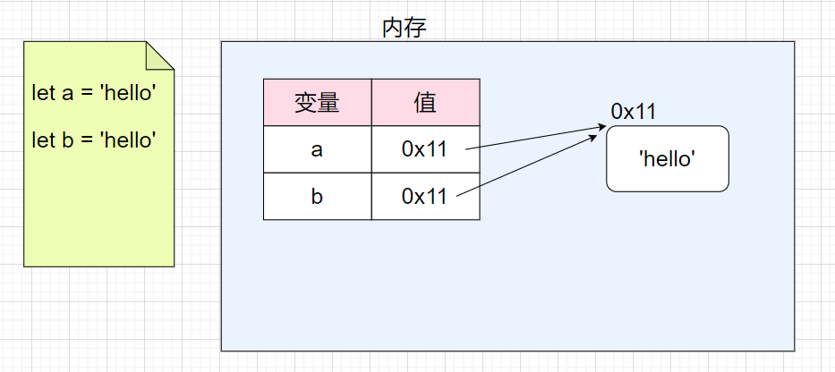

# javascript核心基础笔记

## 目录 
1. 入门
2. 数据类型
3. 运算符
4. 流程控制
5. 对象
6. 函数

## chapter-01.入门
### 1.1 HelloWorld
js有三种输出方式：
1. 通过`alert()`函数输出
2. 通过`console.log()`函数输出
3. 通过`document.write()`函数输出

### 1.2 js代码编写位置
js代码有以下常见编写位置：
1. 写在`<script>写在此处</script>`标签中
2. 写在外部的js文件中，然后用script标签的src属性引入
3. 写在标签的指定属性中，如`<a href="javascript:alert(123);">`

### 1.3 基本语法
1. js的注释，分为行注释和块注释，行注释使用`//这是行注释`，块注释使用`/*这是块注释*/`
2. js严格区分大小写
3. js中的空格和换行会被忽略
4. js中每条语句以分号结尾，如果不写，会自动添加

### 1.4 字面量和变量

1. 字面量：其实就是一个值，它所代表的含义就是它的字面的意思。

   比如：1, 2, 3, "hello"，true, null......

   在js中所有的字面量都可以直接使用。

2. 变量：变量可以用来“存储”字面量，并且变量中存储的字面量可以随意修改。

   变量的使用必须先声明，一般是声明和赋值同时进行，如`let  age = 10`

   声明后如果不赋值，会默认为undefined。

### 1.5 变量的内存

变量中并不直接存储任何值，而是存储值的内存地址。



### 1.6 常量

在js中，使用const声明常量。常量只能赋值一次，常量时不能修改的，重复赋值会报错。常量名一般大写。

例如，`const PI = 3.14`

### 1.7 标识符

在js中，所有可以由我们自主命名的内容，都可以认为是一个标识符，如常量名、函数名、类名等。

标识符命名规定：

1. 只能由数字、字母、下划线、$组成，且不能以数字开头；
2. 不能是js中的关键字和保留字；

命名规范：

1. 通常会使用驼峰命名法-首字母小写，其余每个单词开头大写，如 maxLength；
2. 类名会使用大驼峰命名-首字母大写，每个单词开头大写，如 MaxLength；
3. 常量的字母全部大写，以下划线_分隔单词，如 MAX_LENGTH；
4. 不建议使用 内置函数或类名作为标识符。


## chapter-02.数据类型-原始值

js中数据类型可以分为7种原始值、对象两大类（函数实际上是function类型的实例，也就是说函数也是对象）。

7种原始值：数值number、大整数bitInt、字符串string、布尔boolean、空值null、未定义undefined、符号symbol。

### 2.1 数值和大整数

1. 数值 Number

   - js中所有的整数和浮点数都是Number类型；
   - js中的数值并不是无限大的，当超过一定范围后会显示近似值；
   - Infinity是一个特殊的数值，表示无穷；
   - NaN也是一个特殊的数值，表示非法的数值。

   ```javascript
   let a = 10
   console.log(a) //10
   let b = 1/0
   console.log(b) //Infinity
   let c = 1 - 'hello'
   console.lgo(c) //NaN
   ```

   

2. 大整数 BigInt

   - 大整数使用n结尾，它可以表示的数字范围是无限大。（无限大是指在内存不溢出的情况下！）

   ```javascript
   let d = 9n
   console.log(d)//9n
   ```

   

3. 其他进制数字

   - 二进制，以0b开头
   - 八进制，以0o开头
   - 十六进制，以0x开头

   ```javascript
   let e = 0b1010
   console.log(e) //10 控制台输出的是按照十进制输出
   ```

   

### 2.2 类型检查

使用typeof运算符检查不同的值的类型。

要注意的是，使用typeof检查null的结果是"object"。

```javascript
console.log(typeof 42)//"number"
console.log(typeof 11n)//"bigint"
console.log(typeof (1-'a'))//"number"
console.log(typeof 'blue')//"string"
console.log(typeof true)//"boolean"
console.log(typeof abc)//"undefined"
console.log(typeof null)//"object"
console.log(typeof Symbol(10))//"symbol"
```

> 在 JavaScript 最初的实现中，JavaScript 中的值是由一个表示类型的标签和实际数据值表示的。对象的类型标签是 0。由于 `null` 代表的是空指针（大多数平台下值为 0x00），因此，null 的类型标签是 0，`typeof null` 也因此返回 `"object"`。	——<a href="https://developer.mozilla.org/zh-CN/docs/Web/JavaScript/Reference/Operators/typeof"> MDN</a>

